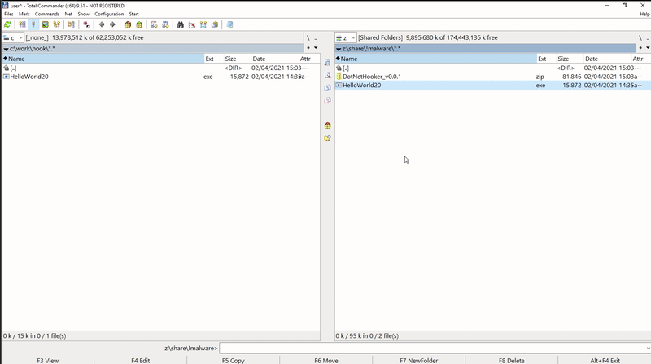

# DotNetHooker
API tracing and argument dumping to ease reverse engineering .NET malware.

DotNetHooker writes into a log file the name of the .NET functions that are called by a .NET executable. 

DotNetHooker is able to dump the arguments of function calls into files - very useful to further analyze malware modules loaded via System.Reflection.Assembly.Load(byte[]).

I personally used it to reverse some Agent Tesla samples.

## Demo

Tracing the functions calls of a .NET 2.0 app, which uses Assembly.Load to load additional code. The loaded assembly is dumped to a file.

## Getting started

- Extract the latest .zip from the releases page, or alternatively build the DLLs yourself.
- Run `install.bat` with administrative privileges. This will register DotNetHooker as an InProc COM server.
- execute `run.bat <path_to_DOT_NET_executable>` to launch the executable with DotNetHooker loaded.
- a file named `DotNetHooker_<PID>.log` should appear containing the function calls performed by the .NET process.
- `run.bat` is configured to dump arguments of System.Reflection.Assembly.Load, can be changed if needed.

## Features

- .NET version 2 to 4 supported
- both x86 and x64 version of .NET executables supported
- stealthy: 
    - malware usually checks for debuggers, but rarely for profilers
    - before .NET code is executed, environment variables needed for profiler are removed to make detection of profiler harder.

## How it works?

DotNetHooker is a .NET profiler that receives callbacks from the CLR when functions are called. Based on the function signature and the argument data provided by the callback, arguments can be dumped to a file.

https://docs.microsoft.com/en-us/dotnet/framework/unmanaged-api/profiling/profiling-overview

https://docs.microsoft.com/en-us/dotnet/framework/unmanaged-api/profiling/functionenter2-function

https://github.com/dotnet/docs/issues/6728#issuecomment-409394385

### Fun fact
Profiler functionality has been abused by malware for persistance, loading DLLs and UAC bypass:

https://redcanary.com/blog/cor_profiler-for-persistence/

## TODOs

- Currently only `string` and `byte[]` argument dumping is implemented
    - implement argument dumping for the rest of the common argument types.
    - implement argument dumping for complex user defined types.
- Create a viewer applications for the log file
    - filtering
    - searching
    - collapsing
- Include and exclude filters for monitored functions, to reduce verbosity/size of log file.
    - similar idea: implement different logging levels. Ex: .ctors and get/seters on trace, while rest on info
